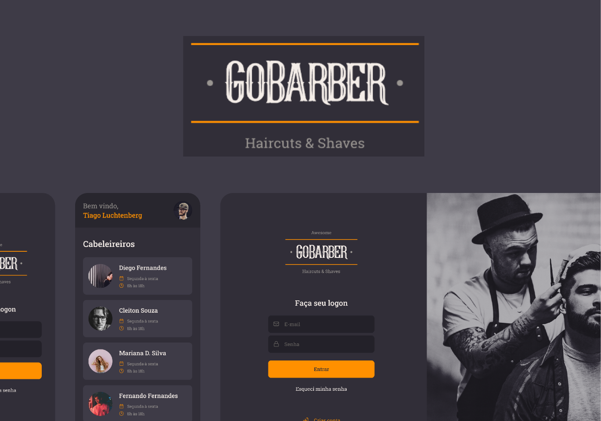

# GoBarber

### Full stack application to schedule appointements at the barber. Built with Typescript, React, React Native and NodeJS.

### Project layers: Web App, Android/iOS App and Rest API

  

## Tech stack

| Layer    | Stack                                          |
| -------- | ---------------------------------------------- |
| Backend  | NodeJS, ExpressJS, Postgres, Typescript        |
| Frontend | React, Typescript, Styled Components, date-fns |
| Mobile   | React Native, Typescript, Styled Components    |

## Node version

Target Node version: 16.20.0

Target NPM version: 8.19.4
